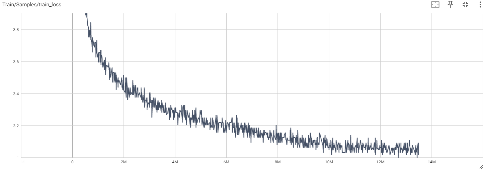
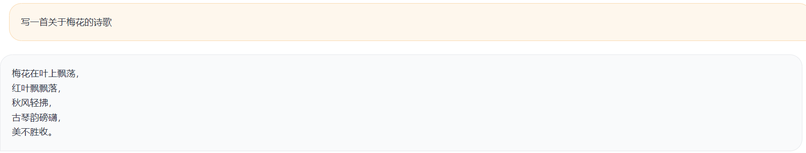
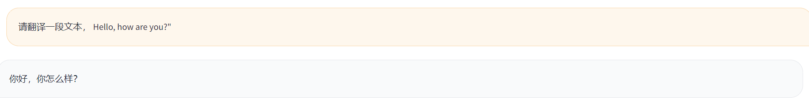
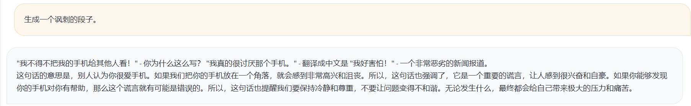
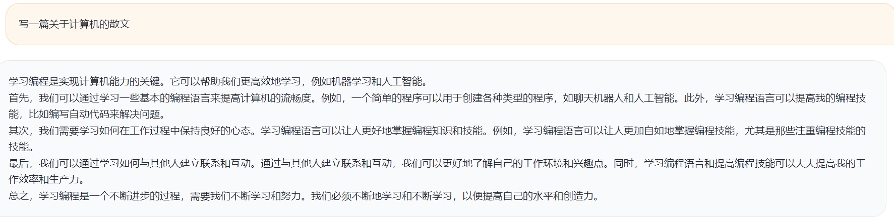

# 0.5BTinyLM预训练与微调

本项目基于Qwen1.5-0.5B，主要用于个人学习，旨在探索大模型构建流程：预训练，微调和RLHF（ToDo）。预训练使用6卡3090，训练长度设置为1024。训练数据集大概有30B Tokens，预计训练6-7天。微调训练长度为2048，后续用LongLora接着在长文本上训练，使用长度为8192。本项目不承担开源导致的风险和责任。

## TODO
- [x] 预训练使用Packing对数据进行打包
- [ ] 使用reward model或ppl做质量过滤
- [ ] 对微调后的模型进行RLHF
- [ ] 微调中引入检索增强

## 训练

使用了两种训练方式，第一种是`deepspeed`流水线并行+数据并行的训练，第二种是`hf trainer`数据并行的方式进行训练。可以结合`ZERO 1、ZERO 2`.

### 预训练

**英文预训练数据**

在[Dolma v1.7](https://huggingface.co/datasets/allenai/dolma)数据集上采了一个子集。原本数据集有5T，这里只采了很少的一部分。Dolma的[论文](https://arxiv.org/abs/2402.00159)中提到该数据集做了相应的数据清洗，质量过滤，因此此处并未对该数据集做任何处理。

下载：
```shell
bash src/data_utils/dolma/download_dolma.sh
```
读取
```shell
import datasets
data = datasets.load_dataset('src/data_utils/dolma', 
                            cache_dir="src/data_utils/dolma/dolma_cache", 
                            split="train",
                            num_proc=24)
```

**中文预训练数据**

1. [baike_qa2019 百科类问答json版](https://github.com/brightmart/nlp_chinese_corpus)

2. [Zhihu-KOL 知乎问答数据](https://huggingface.co/datasets/wangrui6/Zhihu-KOL)

3. [CLUECorpusSmall](https://github.com/CLUEbenchmark/CLUECorpus2020) 该数据集包括新闻语料 news2016zh_corpus、社区互动-语料 webText2019zh_corpus、维基百科-语料 wiki2019zh_corpus、评论数据-语料 comments2019zh_corpus。**有些链接失效**

#### 预训练数据处理
数据处理逻辑在`src/data_utils/dolma`和`src/data_utils/zh_data`
1. 合并各个txt进入json，并用jieba过滤掉小于10词的数据
2. 使用pyspark minihash去除相似数据，再用通过人工规则去掉网页、qq号等
3. 对数据进行packing，将数据打包成1024长度的块（见`src/data_utils/load_pt_data.py`下的group_pretrain_data）。块内部不同的文档用eos token分隔，并且需要在注意力机制中避免跨文档注意力（见`src/pretrain/data_loader.py`）。
中文数据清洗前1700万，清洗后1600万左右。总共的预训练数据集在30B个Tokens左右。

### 开启预训练

理论用时计算：

$$
    days = \frac{8 * 30 * 10^9 * 0.5 * 10^9}{24 * 60 * 60 * 71 * 10^{12} * 0.45} / 6 ≈ 7
$$

$30 * 10^9$ 是训练数据一共有30B个Token， $0.5 * 10^9$ 是模型参数量， $0.45$ 为GPU利用率， $71 * 10^{12}$ 是3090 FP16理论性能(71TFLOPS)，使用6卡3090。实际用时会少于7天。

执行以下命令进行训练，-g 表示gpu编号，-n表示gpu数量。具体参数可以见`conf/tinylm0.5b_pretrain.yaml`。

deepspeed流水线并行
```shell
bash scripts/run_pretrain.sh -t ds_pp -g 1,2,3,4,5,6 -n 6
```
hf trainer：
```shell
bash scripts/run_pretrain.sh -t hf -g 1,2,3,4,5,6 -n 6
```

### 指令微调

先在短文本上以2048为最大长度训练。紧接着在长文本上以8192为最大长度，使用[LongLora](https://github.com/dvlab-research/LongLoRA)微调的方式进行训练。

#### 指令微调数据处理
在`src/data_utils/load_sft_data.py`
1. 统一数据集格式为多轮对话的形式(Human: ... Assistant: ... eos)。
2. 对输入指令进行数据增强，随机删除或者重复指令中的字符。
3. 长文本对大于8192的数据做截断

短文本：
1. [Alpaca英文通用指令 52k](https://github.com/tatsu-lab/stanford_alpaca) 
2. BELLE 中文: [0.5M 通用指令](https://huggingface.co/datasets/BelleGroup/train_0.5M_CN)、[1M 通用指令](https://huggingface.co/datasets/BelleGroup/train_1M_CN)、[3.5M 通用指令](https://huggingface.co/datasets/BelleGroup/train_3.5M_CN)
3. [python-codes-25k](https://huggingface.co/datasets/flytech/python-codes-25k)

长文本：
1. [LongAlpaca-12k](https://huggingface.co/datasets/Yukang/LongAlpaca-12k)
2. [LongAlign-10k](https://huggingface.co/datasets/THUDM/LongAlign-10k)

短文本微调
```shell
bash scripts/run_finetune.sh -t normal -g 1,2,3,4,5,6 -n 6
```
使用longlora在长文本微调
```shell
bash scripts/run_finetune.sh -t long_context -g 1,2,3,4,5,6 -n 6
```

## 结果
### 一些例子
预训练的Loss变化图：

一些问答例子：





### 测评
主要在[CEval](https://github.com/hkust-nlp/ceval)以及[MMLU](https://github.com/hendrycks/test)上进行测试。测试逻辑见`src/evaluation`。主要借鉴了[Baichuan](https://github.com/baichuan-inc/Baichuan-7B/tree/main/evaluation)的测试方法。基本上只比Baseline(25)好一点(26、27)左右。

## 其他
### 环境
- cuda 12.1
- deepspeed 0.14.1
- pytorch 2.2.2
- accelerate 0.29.2
- transformers 4.39.3


